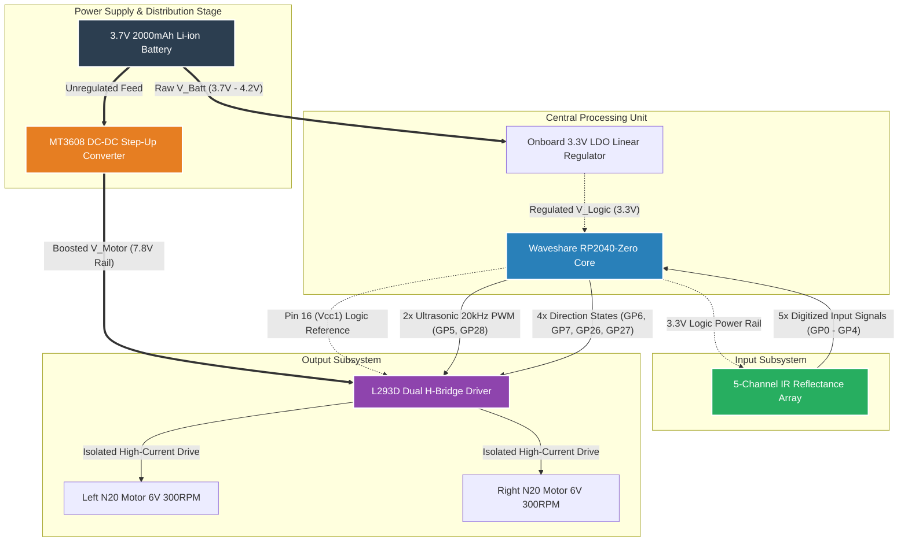

## 2. Hardware Design & Electrical Architecture
The electrical design isolates processing logic from inductive transients. The system utilizes a dual-rail power infrastructure mapped out below:

### 2.1 System Architecture Topology
The structural dependencies, voltage boundaries, and closed-loop data interactions of the system are formally modeled below using a directed graph layout.

### 2.2 Subsystem Functional Analysis & Signal Topology

The comprehensive design decouples the high-frequency switching and inductive loads of the actuation subsystem from the sensitive logic layers of the control core. The physical layout is analyzed below across its discrete operational subsystems.

#### 2.2.1 Data and Signal Loop (Perception-to-Execution Stage)
1. **Perception Layer:** The 5-channel infrared reflectance array utilizes localized TCRT5000 phototransistor blocks to capture surface boundary variations. The sensor converts surface contrast variations into discrete binary inputs ($0$ for white substrate, $1$ for black tracking line). These logic levels interface directly with the microcontroller via pins `GP0` through `GP4`.
2. **Decision Layer:** The Waveshare RP2040-Zero executes a parallel Proportional-Derivative (PD) control algorithm within a sub-millisecond timer loop. It calculates a normalized spatial tracking error from the incoming 5-bit sensor footprint and translates it into differential motor adjustments.
3. **Execution Layer:** The processing core modulates internal hardware timers to output high-frequency commands via pins `GP5` and `GP28`. These commands route directly to the Enable gates (Pins 1 and 9) of the L293D driver chip, while pins `GP6`, `GP7`, `GP26`, and `GP27` establish H-bridge direction states.

#### 2.2.2 Dual-Rail Power Architecture and Isolation Mechanics
Operating an inductive motor system alongside a high-clock-rate microcontroller from a single 3.7V cell introduces severe transient noise and voltage dip vulnerabilities. To achieve field-stable operation, the electrical infrastructure splits power into two separate tracks:

* **High-Impedance Logic Rail:** The raw battery terminal ($3.7\text{V} - 4.2\text{V}$) feeds directly into the `5V` header pad of the RP2040-Zero. The board's onboard low-dropout (LDO) linear regulator drops this voltage down to a clean, stable $3.3\text{V}$. This regulated output powers the RP2040 chip, the 5-channel IR sensor array, and the logic reference pin ($V_{CC1}$, Pin 16) of the L293D, ensuring consistent 3.3V logic matching across all data pins.
* **Low-Impedance Actuation Rail:** To bypass logic circuitry entirely, the raw battery line links directly to the input of the MT3608 boost converter. The converter steps this voltage up to a stable $7.8\text{V} - 8.0\text{V}$, feeding it exclusively into Pin 8 ($V_{CC2}$) of the L293D. This voltage offset compensates for the driver's internal Darlington transistor saturation drop ($\sim1.8\text{V}$), delivering a precise 6V across the terminals of the N20 micro gear motors for optimal speed and torque execution.

#### 2.2.3 Transient Filtering and Reset Prevention
Inductive loads generate sharp negative current spikes and high-frequency noise during quick speed changes or motor reversals. To prevent these noise transients from causing microcontroller brownouts or resets, the system utilizes two filtering stages:
1. **Bulk Capacitance Buffer:** A $100\mu\text{F}$ to $470\mu\text{F}$ electrolytic bulk capacitor is soldered directly across the output terminals (`OUT+` and `OUT-`) of the MT3608 boost module. This capacitor acts as a low-impedance power reservoir that satisfies high startup current demands without pulling down the shared battery line.
2. **Decoupling Snubbers:** High-frequency electrical brush arcing noise is suppressed at the source by placing a $0.1\mu\text{F}$ ceramic decoupling capacitor across the physical power terminals of each N20 motor.