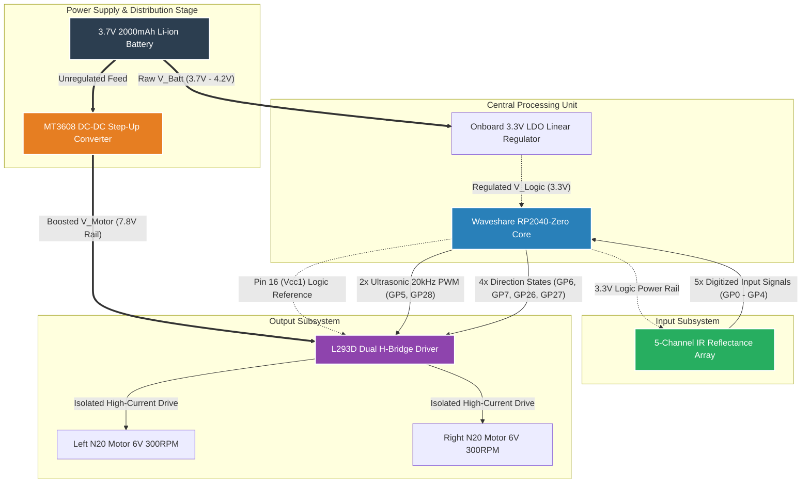

## 2. Hardware Design & Electrical Architecture
The electrical design isolates processing logic from inductive transients. The system utilizes a dual-rail power infrastructure mapped out below:

### 2.1 System Architecture Topology
The structural dependencies, voltage boundaries, and closed-loop data interactions of the system are formally modeled below using a directed graph layout.

### 2.2 Transient Noise Mitigation
A bulk electrolytic capacitor ($100\mu\text{F} - 470\mu\text{F}$) is positioned across the MT3608 output terminals to serve as a low-impedance reservoir during abrupt motor direction or velocity changes, preventing voltage sags from causing microcontroller resets.    